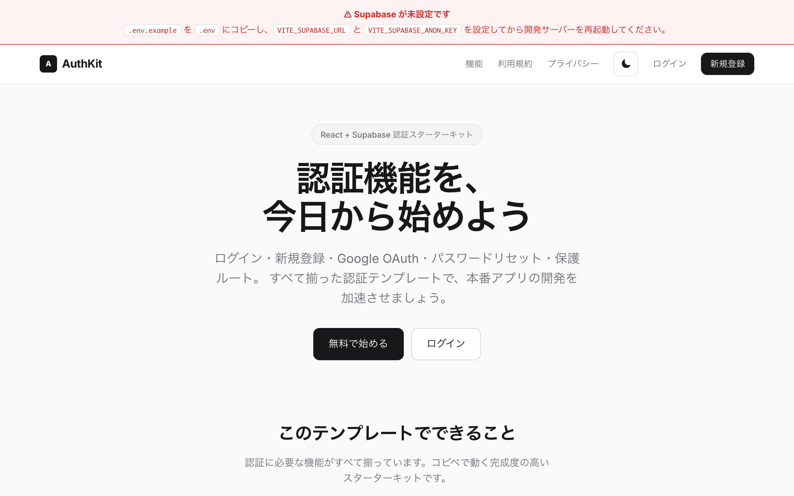
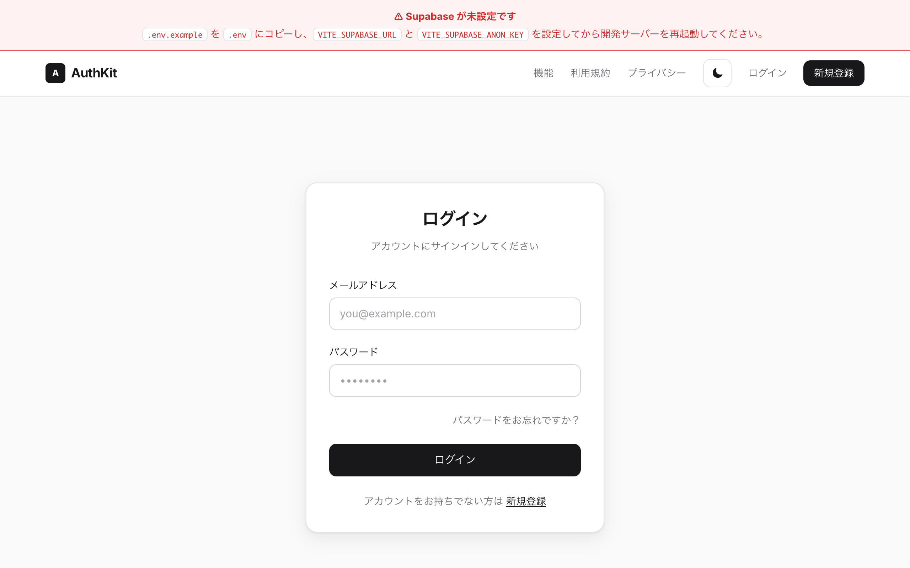
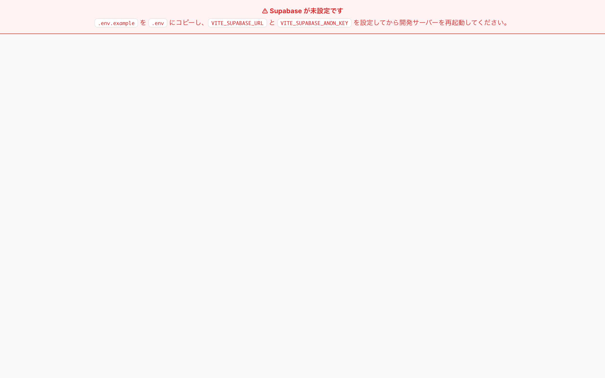
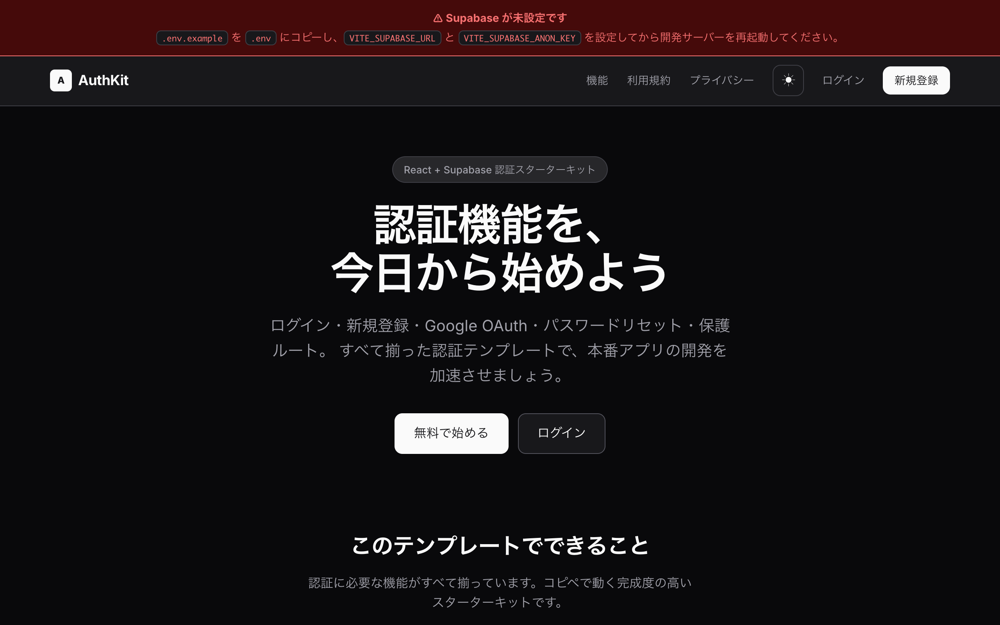

# AuthKit Demo

AuthKit is a React + Supabase authentication starter kit.

## Features

- Email login
- Email signup
- Password reset
- Google OAuth
- Protected routes
- Dashboard page
- Dark mode
- Responsive design
- TypeScript
- Vite
- Supabase Auth

## Screenshots

### Home

### Login

### Dashboard

### Dark Mode

## Get AuthKit

Download the full source code here:

https://happyweb.gumroad.com/l/fbdyl

## Tech Stack

- React
- TypeScript
- Vite
- Supabase
- CSS Modules

## Note

This repository is for demo and promotion only.  
The full source code is available on Gumroad.
